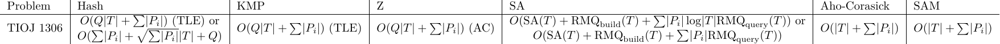

# IOICamp 2025 字串演算法

- Hash, KMP, Z, Aho-Corasick, SAM are tested at [TIOJ 1306 字串中的字串](https://tioj.ck.tp.edu.tw/problems/1306)
- Suffix BST is tested at [Codeforces 103328D](https://codeforces.com/problemset/gymProblem/103328/D)

---

## 習題

- 能用其他技巧做的都不會放在 hash，如果有很多題目可以用 hash 做是正常的。
- 請試著用多種方法做題、少用 hash！
- 每個主題大致按照感性難度排序……吧。
- 推刷 CSES 字串區，但是不推拿這區來驗模板（測資稍弱）。

### 字串匹配

Hash：
- [TIOJ 2205 迴迴奇文](https://tioj.ck.tp.edu.tw/problems/2205)
    - 請用 rolling hash 做做看 ><
- [TIOJ 1735 k-口吃子字串](https://tioj.ck.tp.edu.tw/problems/1735)
    - 也可以試試看不要 hash

KMP 和 Z：
- $O(n)$ Z value 轉 fail function
- $O(n)$ fail function 轉 Z value
    - [NTUCPCOJ 214 兩全其美](https://oj.ntucpc.org/problems/214)
- 給定字串 $A, B$ 以及一個整數 $k$，求出所有 $B$ 在 $A$ 中 $k$ 幾乎匹配的位置。
    我們稱 $A[i, i+n-1], B[j, j+n-1]$ 是 $k$-幾乎匹配如果 $\\{ A[i+x] \ne B[j+x], 0 \le x \le n-1 \\}$ 的個數不超過 $k$ 個。
    - $O(k \lvert A \rvert + \lvert B \rvert)$
    - 這題也可以 $\Sigma$ 次卷積做……
- [Library Checker Z Algorithm](https://judge.yosupo.jp/problem/zalgorithm)
- [TIOJ 1515 Problem E. 似曾相識](https://tioj.ck.tp.edu.tw/problems/1515)
- [Codeforces 471D MUH and Cube Walls](https://codeforces.com/problemset/problem/471/D)
- [Codeforces 535D Tavas and Malekas](https://codeforces.com/problemset/problem/535/D)
- [NEOJ 263 誒底的字串](https://neoj.sprout.tw/problem/263)
- [TIOJ 1531 kukukey](https://tioj.ck.tp.edu.tw/problems/1531)
- [Codeforces 526D Om Nom and Necklace](https://codeforces.com/problemset/problem/526/D)
- [TIOJ 1725 Massacre at Camp Happy](https://tioj.ck.tp.edu.tw/problems/1725)
- [CSES Required Substring](https://cses.fi/problemset/task/1112/)
    - 上課時有說過可以對自動機 DP，剛好這題很像是對只有一個字串的 AC 自動機（KMP）的狀態做 DP……
    - 搞不好多個字串的也可以做……？
- [POI XIII Periods of Words](https://loj.ac/p/10046)
- [POI XII Task Template](https://szkopul.edu.pl/problemset/problem/PT4yHRX9Mmz85ndhNPGCi_WB/site/?key=statement) [解](https://cbdcoding.blogspot.com/2015/07/poi-12-stage-2-template.html)
- [Codeforces 514C Watto and Mechanism](https://codeforces.com/problemset/problem/514/C)
- [Codeforces 126B Password](https://codeforces.com/problemset/problem/126/B)
- [Codeforces 432D Prefixes and Suffixes](https://codeforces.com/problemset/problem/432/D)
- [2021 ICPC Taipei pK Insertion Array](https://codeforces.com/gym/103443/problem/K)

回文：

- [SPOJ LPS](https://www.spoj.com/problems/LPS/)
- [Library Checker Enumerate Palindromes](https://judge.yosupo.jp/problem/enumerate_palindromes)
- [Codeforces 1326D2 Prefix-Suffix Palindrome (Hard version)](https://codeforces.com/problemset/problem/1326/D2)

### 字串比較與後綴資料結構

SA:
- [TIOJ 1497 喝醉的宿主 The drunk host](https://tioj.ck.tp.edu.tw/problems/1497)
- [Library Checker Suffix Array](https://judge.yosupo.jp/problem/suffixarray)
- [Library Checker Number of Substrings](https://judge.yosupo.jp/problem/number_of_substrings)
- [CSES Substring Order I](https://cses.fi/problemset/task/2108/)
    - 做法精神和數相異子字串數雷同
    - 請試著做到 $O(\text{SA} + n)$
- [CSES Substring Order II](https://cses.fi/problemset/task/2109/)
    - 做法精神和前兩題雷同
    - 請試著做到 $O(\text{SA} + n)$
- 最長重複子字串：給定字串 $S$，求出 $S$ 的所有子字串中，出現至少兩次的、最長的那個。
    - 例： $S = \texttt{cabababc}$ ，最長的重複子字串為 $\texttt{aba}$。
    - $O(\text{SA} + n)$
    - 兩者不能重疊的話是 $O(n \log n)$
    - [CSES Repeating Substring](https://cses.fi/problemset/task/2106)
- [Codeforces 128B String](https://codeforces.com/problemset/problem/128/B)（第 K 小子字串）
- [Codeforces 1252D Find String in a Grid](https://codeforces.com/problemset/problem/1252/D)
- [2020 IOICamp Day5 pD 小風數堅果](https://oj.ntucpc.org/problems/267)
    - 用 $O(n \log n)$ 蓋 SA 也可以過，不過其他部份要聰明一些（就算用 [SAIS](https://github.com/OmeletWithoutEgg/ckiseki/blob/master/codes/String/SAIS-C%2B%2B20.cpp) 也一樣）
- 以下三題 idea 類似：
    - 用 SA 做 [Main-Lorentz](https://cp-algorithms.com/string/main_lorentz.html)
    - [The 3rd Universal Cup, Stage 14: Harbin, pD A Simple String Problem](https://codeforces.com/gym/105459/problem/D)
    - 最多次連續重複子字串：給一個字串 $S$，求出他的連續重複次數最多的子字串。
        - 例： $A = \texttt{cababababc}$ ， $\texttt{ab}$ 在子字串 $\texttt{abababab}$ 中連續重複了 $4$ 次。
        - $O(\text{SA} + n \log n)$
    - 似乎都可以分治，但是可以用一個酷酷的技巧（待補，來問我！）

Suffix BST：
- [Luogu 6164 【模板】后缀平衡树](https://www.luogu.com.cn/problem/P6164)
- [NTU NCPC Preliminary 2021 pD String Repetition](https://codeforces.com/problemset/gymProblem/103328/D)

### 字串與自動機

先觀察性質再思考如何使用科技！

- [Codeforces 633C Spy Syndrome 2](https://codeforces.com/problemset/problem/633/C)
- [NTU NCPC Preliminary 2021 pD String Repetition](https://codeforces.com/problemset/gymProblem/103328/D)
- [2013-2014 ACM-ICPC, NEERC, Northern Subregional Contest C Correcting Curiosity](https://codeforces.com/gym/100269)（很難）
- [Codeforces 700E Cool Slogans](https://codeforces.com/problemset/problem/700/E)
- [Codeforces 235C Cyclical Quest](https://codeforces.com/problemset/problem/235/C)
- [2020 IOICamp Day5 pD 小風數堅果](https://oj.ntucpc.org/problems/267)

### 更多習題

- https://codeforces.com/blog/entry/49938
- https://codeforces.com/blog/entry/111380

---

## 延伸閱讀及參考資料

###  Rolling Hash
- [模 2^64 - 1（非質數）的 Rolling Hash 實作](https://github.com/kth-competitive-programming/kactl/blob/main/content/strings/Hashing.h)
- [超安全 Rolling Hash 實作](https://github.com/kth-competitive-programming/kactl/blob/main/content/strings/Hashing-codeforces.h)
- [[Tutorial] Rolling hash and 8 interesting problems [Editorial]](https://codeforces.com/blog/entry/60445)
- [On the mathematics behind rolling hashes and anti-hash tests](https://codeforces.com/blog/entry/60442)
- [OI Wiki 字符串哈希](https://oi-wiki.org/string/hash/)

### KMP & Z

- [KMP 和 Z 的轉換（俄文）](https://codeforces.com/blog/entry/9612)
- [Z value 哪來的？](https://codeforces.com/blog/entry/15727?#comment-206325)

### Manacher

不知道有沒有？

### Suffix Array

- [DC3（線性構造 SA）教學](https://raw.githubusercontent.com/vikasawadhiya/DC3-Algorithm/main/DC3AlgorithmTutorial.pdf)
- [SA-IS（線性構造 SA）教學](https://zork.net/~st/jottings/sais.html)

### Automata

- [Introduction to the Theory of Computation, 3rd edition by Michael Sipser](https://math.mit.edu/~sipser/book.html)
    - 有興趣的可以讀讀看第一章（網路上應該找得到 PDF 檔）。
- [AC 自動機 $O(N \sqrt N)$ 找相異子字串的實作](https://github.com/kth-competitive-programming/kactl/blob/main/content/strings/AhoCorasick.h)
- [SAM Visualization](https://kg86.github.io/visds/dist/vis_dawg.html)
- [SAM Tutorial](https://cp-algorithms.com/string/suffix-automaton.html)

### 上課沒時間教的

Minimum rotation / [Lyndon factorization](https://cp-algorithms.com/string/lyndon_factorization.html) 
的做法都是簡單（？）的 Greedy 和均攤分析（很像 KMP & Z），實作可以看 [這裡](https://github.com/fhvirus/kactl-toki/tree/main/content/strings)。
